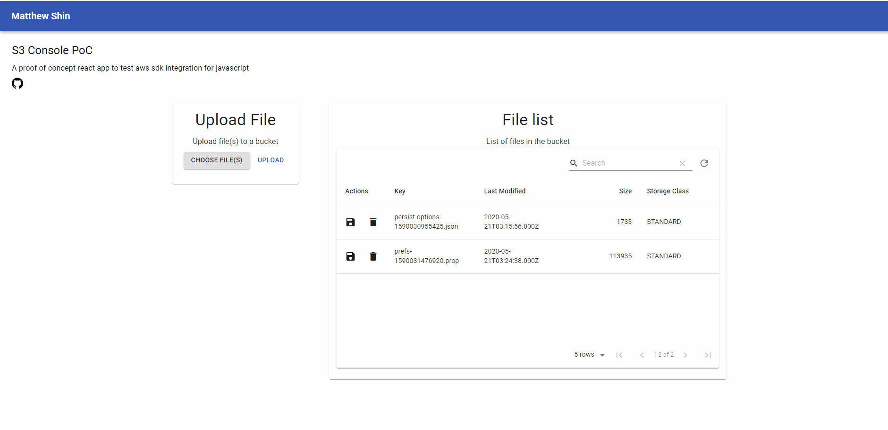

# s3console_poc



## Description

A proof of concept react app written in typescript that utilizes [aws sdk for javascript](https://docs.aws.amazon.com/sdk-for-javascript/index.html) to perform basic s3 calls within a react app to an S3 server.

## Operations

- PUT - Able to put file(s) into a bucket as individual objects (hardcoded arbitrary limit of 5 files)
- LIST - Recursively calls list object to list all objects in a bucket to the table
- GET - Download a file by clicking the save icon in the table
- DELETE - Delete object by clicking the trash icon in the table

## Requirements

- [nodejs](https://nodejs.org/en/download/package-manager/#debian-and-ubuntu-based-linux-distributions-enterprise-linux-fedora-and-snap-packages)

## Installation

1. Clone the repo
2. In the base project directory `s3console` run `npm i` (or `npm install` if your node version does not support this)
3. Run `install-all` to install client and server module dependencies as well
4. Create a file `.env` in `./server` directory (this won't be pushed via .gitignore). Currently it is required to hardcode the S3 access key, secret key, bucket name, and endpoint that you want to run requests, e.g.

```
AWS_ACCESS_KEY_ID=*ACCESSKEY*
AWS_SECRET_ACCESS_KEY=*SECRETKEY*
S3_BUCKET=*BUCKETNAME*
```

5. Run `npm run dev` to start the app (client uses port 3000, server uses port 5000)

## Tech Stack

- Express
- React
- Node

## Resources

- [AWS SDK API](https://docs.aws.amazon.com/AWSJavaScriptSDK/latest/AWS/S3.html)
- [AWS SDK JavaScript Code Examples](https://docs.aws.amazon.com/sdk-for-javascript/v2/developer-guide/sdk-code-samples.html)
